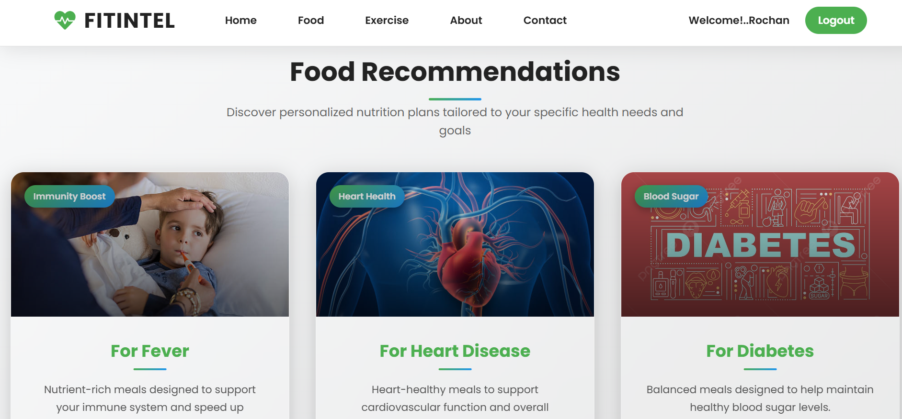
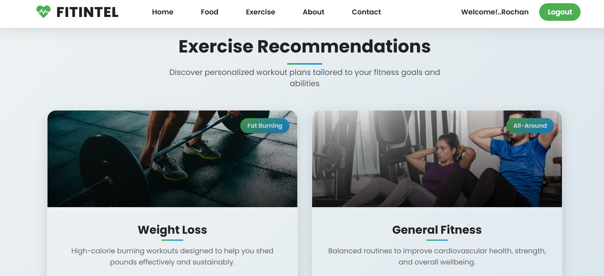

# FitIntel

FitIntel is an AI-powered health and fitness web application designed to provide personalized food and exercise recommendations. By combining machine learning models with a modern, user-friendly interface, FitIntel helps users achieve their health goals through smarter, data-driven advice.

## Features

- **Personalized Diet Planner:** Get meal recommendations tailored to your age, weight, height, dietary preferences, and weight loss goals.
- **Exercise Recommendations:** Discover workout plans suited to your fitness level and objectives.
- **User Authentication:** Secure login and registration for personalized experiences.
- **Modern Responsive Design:** Mobile-friendly UI with attractive cards, gradients, and interactive menus.
- **AI Models:** Uses pre-trained models for diet, exercise, fever, and heart health predictions.
- **Dashboard:** View your profile and track your fitness journey.

## How It Works

1. **Sign Up / Login:** Create an account to access personalized features.
2. **Diet Planner:** Enter your details to receive a custom meal plan.
3. **Exercise Planner:** Get exercise suggestions based on your profile.
4. **Recommendations:** All plans are generated using AI models trained on health and nutrition data.


## Technologies Used

- Python (Flask)
- MongoDB Atlas (cloud database, using PyMongo)
- HTML, CSS (Tailwind, custom styles)
- JavaScript (Axios for API calls)
- Scikit-learn, joblib, pickle (for ML models)
- Responsive design for all devices


## Getting Started

1. Clone the repository.
2. Install dependencies from `requirements.txt` (includes `pymongo` for MongoDB):
   ```
   pip install -r requirements.txt
   ```
3. Set your MongoDB Atlas connection string in `config.py` (default is provided for FitIntel cluster).
4. Place all required model files in the `models/` directory (if using ML features).
5. Run the Flask app:
   ```
   python app.py
   ```
   Or run:
   ```
   python main.py
   ```
   to check if all models are loaded correctly before starting the app.
6. Open your browser at `http://127.0.0.1:5000/`.


## Project Structure

- `app.py`, `main.py`: Backend logic and routes
- `config.py`: MongoDB Atlas connection setup
- `models.py`: User model and database logic (now using MongoDB)
- `templates/`: HTML templates for all pages
- `static/`: Images and CSS

## Screenshots

### Home Page


### Food Recommendations


### Exercise Planner

- `models/`: Pre-trained ML models

## Why FitIntel?

FitIntel empowers users to take control of their health with personalized, actionable recommendations. Whether you want to lose weight, eat healthier, or improve your fitness, FitIntel provides the tools and guidance you need.
